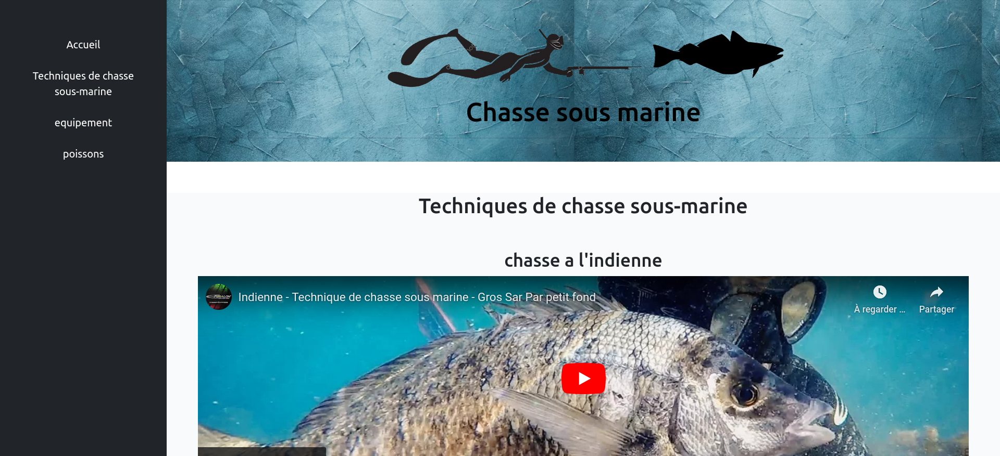

# Spearfishing Website

This project was completed as part of my training program. It's my first website, created around one of my favorite hobbies, spearfishing. The site was designed using HTML, CSS, and Bootstrap for a user-friendly layout.

## Site Content

The site includes information about spearfishing, techniques, equipment, popular spearfishing locations, and personal accounts of my own experiences.

## Accessing the Site

To access the site, open the `index.html` file in your web browser.

## Features

- User-friendly interface with an optimized layout thanks to Bootstrap.
- Informative content about spearfishing and personal experiences.

Enjoy exploring the world of spearfishing through my website!
